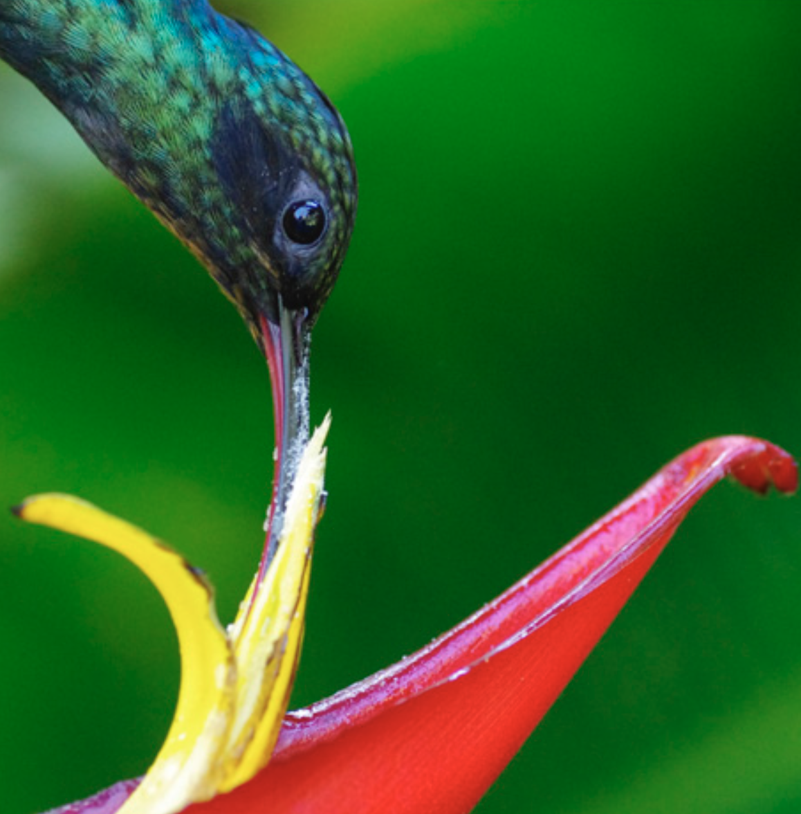

$~$

# Current Projects

$~$

### Combining sparse regression techniques with time-series models

 Long-term ecological data is invaluable for elucidating ecological dynamics through time, especially as our climate and landscapes change. However, statistical methods for extracting key information from such data are not commonplace in ecology. My collaborators in the [EPSCoR Modelscapes consortium](https://microcollaborative.atlassian.net/wiki/spaces/MP/overview) and I are working on developing non-Gaussian, dynamic (i.e., time-series) models that incorporate sparse regression techniques capable of identifying relationships between a response variable and key explanatory variables out of a large set of candidate variables. We expect these models may be useful for identifying key biological interactions in diverse communities from observational cover, density, or count data, among many other potential uses.

$~$

### Landscape genetics of western columbine (*Aquilegia formosa*) across a forest-meadow mosaic

Woody plant encroachment into alpine meadows may reduce and fragment the habitat available to meadow plant communities. This could reduce population connectivity of alpine plant populations if seeds or pollen fail to disperse across forested areas, reducing effective population sizes, genetic diversity, and adaptive potential.

There are at least two mechanisms by which meadow fragmentation by forest encroachment could reduce the connectivity of meadow plant populations: **1)** a mechanism of isolation-by-resistance in which forest cover impedes pollen and/or seed dispersal to other meadows; **2)**  the possibility that forest cover may reduce resource discovery for pollinators by concealing herbaceous plants, thereby reducing gene flow to plants overgrown by taller forest species. 

Colleagues and I are testing these hypotheses using genetic data from 192 western columbine (*Aquilegia formosa*) plants across a forest-meadow mosaic landscape in the [H. J. Andrews Experimental Forest](https://andrewsforest.oregonstate.edu/). As of December 2021, we have submitted a manuscript describing our findings to *Journal of Ecology* for consideration of publication.

<figure>
  
  <figcaption>Predicted trends in genetic similarity with the <i>isolation-by-resistance</i> (<b>a</b>) and the <i>isolation by concealment</i> (<b>c</b>) hypotheses. <b>b)</b> A schematic of relative rates of pollen-mediated gene flow through a hypothetical landscape under the isolation-by-resistance hypothesis. White coloration represents open habitat and grey represents forested habitat. Neighboring plants in connected patches show reduced similarity (i.e., are less related) compared to neighboring plants in isolated locations ($m_2 < m_1$) due to reduced resistance to long-distance pollen movement through well-connected landscapes. Forested areas, however, resist pollen flow resulting in a greater effective distance between patches and therefore reduced genetic similarity ($m_4 < m_3 < m_2 < m_1$). **d)** Mechanisms underlying the isolation by concealment hypothesis. If pollinators fly over the canopy to forage in disconnected meadows, we predict that plants at the edge of the woody invasion and overgrown by taller woody plants will be obscured and more frequently go undiscovered by pollinators *(i)*. This could allow for greater rates of mating amongst nearby relatives and/or greater selfing rates underneath forest canopies compared to in the open ($m_1 > m_2$). However, at greater distances, the probability of pollen transfer between two "concealed" individuals should be much less than the probability of pollen transfer between two plants in the open, resulting in a steeper spatial decay of genetic relatedness when comparing plants under the canopy ($m_4 < m_3 < m_2 < m_1$).</figcaption>
</figure>
    
$~$

### Pollinator recognition in tropical *Heliconia spp.*

Many plants have evolved floral traits that reduce visitation by a subset of floral visitors, promoting pollination by efficient pollinators. However, recent results from experiments with *Heliconia tortuosa* (Heliconiaceae) indicate that an additional filter may exist after pollinator visitation. [Betts et al. (2015)](https://doi.org/10.1073/pnas.1419522112) found that pollen tube germination was enhanced following visits from morphologically matched pollinators, but not mismatched pollinators after standardizing pollen quality and visitation rates. This plant behavior, ‘pollinator recognition’ (PR), is thought to promote outcrossing by conferring the capacity to preferentially invest in reproduction following visits by long-ranging hummingbirds with specialized bills. To date, PR has only been described in H. tortuosa, but it could have important ecological implications if common among plant species; if abundances of morphologically matched pollinators decline, visits by mismatched pollinators would not compensate for the loss of pollination services to plants with PR. Therefore, our goal with this project is to test for PR in multiple taxa spread widely across the Heliconiaceae phylogeny to search for evidence that PR may be a more common plant behavior than currently recognized.

<figure>

<figcaption>Green Hermit Hummingbird (*Phaethornis guy*) visiting *Heliconia tortuosa*. Photo credit: Matt Betts.</figcaption>
</figure>

$$
~
$$

# Past projects

$~$

### Hummingbird movement across a forest-meadow mosaic

 Check out work colleagues and I published on hummingbird movements through the [H. J. Andrews Experimental Forest](https://andrewsforest.oregonstate.edu/) and implications for pollen flow of ornithophilous plants. 

* Gannon, D. G., A. S. Hadley, and S. J. K. Frey. 2021. Pairing automated mark–recapture and social network models to explore the effects of landscape configuration on hummingbird foraging patterns. *Biology Letters* 17. [doi: 10.1098/rsbl.2021.0188](https://doi.org/10.1098/rsbl.2021.0188)

<figure>
  
  <figcaption>Predicted probability of movement between two food sources with increasing distance and changes in the surrounding landscape. The panels to the right illustrate the change in landscape configuration used to create the line plots. **a)** The probability of at least one movement per bird per week (y-axis) between two food sources decreases with increasing distance (x-axis) and is expected to be 45.12\% lower if the two locations are isolated by intervening forest *(ii)*. *(i)* depicts two food sources in open habitat with 0\% intervening forest. *(ii)* depicts two food sources in open habitat with 100\% intervening forest. **b)** *(i)* both sources in the open and *(iii)* both under coniferous forest canopy, holding intervening forest at 0\%. **c)** *(i)* both food sources in the open and *(iv)* both sources grown over by woody vegetation and separated by 100\% forest.</figcaption>
</figure>

