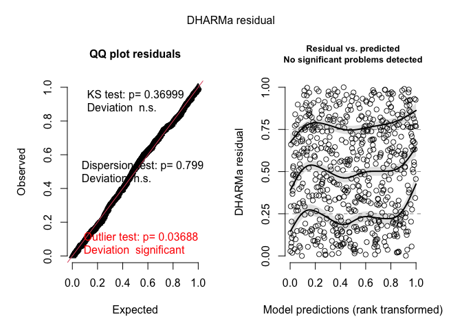
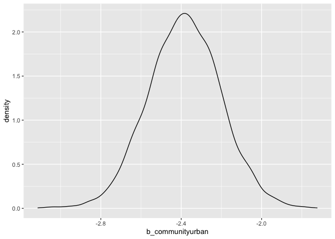

A tutorial on analyzing ordinal data
================
September 2024

true

# Introduction

Lately in my consulting practice, I have had many questions about
analyzing *ordinal data*, that is, categorical data for which the
categories can be ordered in a way that makes sense. For example, the
“star system” you may have used to rate that restaurant you visited in
Portland that took an hour to seat you, played music too loud to hear
the conversation, and then charged absurd prices for mediocre small
plates that left you still hungry at the end on some social rating
platform is a type of ordinal scale. The star system yields ordinal data
because a 3-star rating is greater/better than a two-star rating, but
the data aren’t really numeric but rather categorical.

Indeed, it may be tempting to treat the data as numeric. After all, an
average rating of 3.2 is greater than an average rating of 2.7. However,
treating the data as numeric implicitly assumes that 2 is exactly one
unit greater than a rating of 1 and one unit less than a rating of 3,
and that a 5 is still only one unit better than a 4. But ask yourself,
“*is that really the way I rate restaurants?*”. Personally, I might give
a 4-star rating to any good restaurant, but I reserve a 5-star rating
for the best of the best, which are *way* better than the good
restaurants. Similarly, 1-star reviews are reserved for the bottom of
the barrel and the difference between 1 and 2 stars is a lot greater
than the difference between 3 and 4 stars in my mind.

Because of this *unequal spacing* issue, ordinal data get their own
distinction and usually should not be treated as numeric unless
well-justified by prior knowledge. But, how can we analyze such data?
Below I present one option that is in line with a generalized linear
modeling (GLM) approach.

# Motivating example

Assume we have distributed a short survey to 100 people from each of two
communities, one rural and one urban, and asked the respondents to rate
three pictures of the same national park but taken at different
locations in terms of how desirable each looks as a vacation
destination. The first picture includes strictly “natural” scenery, the
second includes some trails through meadows with some people hiking on
them, and the last includes a gift shop and a welcome center with a
stunning backdrop. The hypothesis is that people will gravitate towards
the familiar, so those living in urban areas will rate the second two
photos higher than the first since there are more signs of familiar
human development in them, while people from rural areas will rate the
photos with less evidence of human influence higher.

> Important caveat: I am not a social scientist and am just making this
> stuff up! Forgive me if you are a social scientist and this is totally
> ridiculous 🙂.

A summary of these fictitious data is shown in Table
<a href="#tab:dat-summary">1</a>.

| community | photo     | mean_rating | n_respondents |
|:----------|:----------|------------:|--------------:|
| rural     | buildings |        3.10 |           100 |
| rural     | natural   |        4.59 |           100 |
| rural     | trails    |        3.97 |           100 |
| urban     | buildings |        3.80 |           100 |
| urban     | natural   |        2.54 |           100 |
| urban     | trails    |        3.87 |           100 |

<span id="tab:dat-summary"></span>Table 1: Data summary.

# Ordered Probit Model

With the ordered probit model, we imagine a normal distribution on a
*latent* (i.e., unobserved) scale with mean equal to the linear
predictor for observation $$i = 1,2,...,n$$,

$$
\eta_i = {\bf x}_i^\top \boldsymbol \beta
$$

and a variance of $$\sigma^2 = 1$$. So far, this is simply multiple
regression, we just don’t get to *see* this regression on the continuous
scale. Instead, what we observe is a *filtered version* of the “true”,
continuous observation (e.g., how appealing a given photo is to the
respondent on a continuous, unbounded scale). Specifically, we define a
set of $$K-1$$ thresholds, $$\theta_1, ..., \theta_{K-1}$$, where $$K$$
is the number of categories in the ordinal variable (5 in our example).
It is assumed that $$\theta_0 = -\infty$$ and $$\theta_K = \infty$$. The
“filtering” process we imagine assumes that a realization from the
normal distribution with mean $${\bf x}_i^\top \boldsymbol \beta$$ and
variance of 1, denoted $$y_i^*$$, gets “binned” into the ordinal
categories by the thresholds. So, for example, if
$$\theta_{1} < y_i^* \le \theta_2$$, then the respondent would provide a
rating of 2 stars. If instead $$\theta_4 < y_i^* < \infty = \theta_5$$,
then the respondent would provide a rating of 5 stars.

Given this model, we define the probability that a given person with
covariates $${\bf x}_i$$ gives a rating of $$k$$ as

$$
P(\theta_{k-1} < {\bf x_i}^\top \boldsymbol \beta + \epsilon_i < \theta_k)
$$

where
$$\epsilon_1, \epsilon_2, ..., \epsilon_n \sim \mathcal{N}({\bf 0}, \Omega)$$
and $$\Omega$$ is an $$n\times n$$ correlation matrix (it’s a
correlation matrix rather than a covariance matrix since we assume the
errors have variance of 1). Given the data, we jointly estimate the
parameters
$$(\boldsymbol \beta, \boldsymbol \theta, \boldsymbol \Omega)$$, though
it is most often assumed that the errors are independent such that
$$\Omega = I_n$$.

## Fitting the model using `brms`

While there are a few R packages out there than can estimate ordered
probit models, `brms` (i.e., Bayesian Regression Models using Stan) is
the most flexible. Furthermore, it uses syntax to define models that
will be familiar to many R users and it is possible to use the posterior
predictions to check model fit. Here is an example using the fictitious
data described in Section <a href="#motivating-example">2</a>.

``` r
library(brms)
library(tidyverse)

# ensure our variables are of the correct class
dat <- dat %>% mutate(
  photo = factor(
    photo,
    levels = c("natural", "trails", "buildings")
  ),
  community = factor(community),
  person = factor(person),
  rating = ordered(rating)
)

# fitting the model
mfit_init <- brm(
  rating ~ photo * community + (1 | person),
  family = cumulative(link = "probit"),
  data = dat,
  cores = 4
)
```

    ## Running /Library/Frameworks/R.framework/Resources/bin/R CMD SHLIB foo.c
    ## using C compiler: ‘Apple clang version 15.0.0 (clang-1500.3.9.4)’
    ## using SDK: ‘’
    ## clang -arch x86_64 -I"/Library/Frameworks/R.framework/Resources/include" -DNDEBUG   -I"/Library/Frameworks/R.framework/Versions/4.4-x86_64/Resources/library/Rcpp/include/"  -I"/Library/Frameworks/R.framework/Versions/4.4-x86_64/Resources/library/RcppEigen/include/"  -I"/Library/Frameworks/R.framework/Versions/4.4-x86_64/Resources/library/RcppEigen/include/unsupported"  -I"/Library/Frameworks/R.framework/Versions/4.4-x86_64/Resources/library/BH/include" -I"/Library/Frameworks/R.framework/Versions/4.4-x86_64/Resources/library/StanHeaders/include/src/"  -I"/Library/Frameworks/R.framework/Versions/4.4-x86_64/Resources/library/StanHeaders/include/"  -I"/Library/Frameworks/R.framework/Versions/4.4-x86_64/Resources/library/RcppParallel/include/"  -I"/Library/Frameworks/R.framework/Versions/4.4-x86_64/Resources/library/rstan/include" -DEIGEN_NO_DEBUG  -DBOOST_DISABLE_ASSERTS  -DBOOST_PENDING_INTEGER_LOG2_HPP  -DSTAN_THREADS  -DUSE_STANC3 -DSTRICT_R_HEADERS  -DBOOST_PHOENIX_NO_VARIADIC_EXPRESSION  -D_HAS_AUTO_PTR_ETC=0  -include '/Library/Frameworks/R.framework/Versions/4.4-x86_64/Resources/library/StanHeaders/include/stan/math/prim/fun/Eigen.hpp'  -D_REENTRANT -DRCPP_PARALLEL_USE_TBB=1   -I/opt/R/x86_64/include    -fPIC  -falign-functions=64 -Wall -g -O2  -c foo.c -o foo.o
    ## In file included from <built-in>:1:
    ## In file included from /Library/Frameworks/R.framework/Versions/4.4-x86_64/Resources/library/StanHeaders/include/stan/math/prim/fun/Eigen.hpp:22:
    ## In file included from /Library/Frameworks/R.framework/Versions/4.4-x86_64/Resources/library/RcppEigen/include/Eigen/Dense:1:
    ## In file included from /Library/Frameworks/R.framework/Versions/4.4-x86_64/Resources/library/RcppEigen/include/Eigen/Core:19:
    ## /Library/Frameworks/R.framework/Versions/4.4-x86_64/Resources/library/RcppEigen/include/Eigen/src/Core/util/Macros.h:679:10: fatal error: 'cmath' file not found
    ## #include <cmath>
    ##          ^~~~~~~
    ## 1 error generated.
    ## make: *** [foo.o] Error 1

Generally, you don’t want to make a habbit of looking at the summary
right after fitting a model, but rather check the assumptions first.
However, I’m going to break that rule this time to point out the model
components and parameters.

``` r
summary(mfit_init)
```

    ##  Family: cumulative 
    ##   Links: mu = probit; disc = identity 
    ## Formula: rating ~ photo * community + (1 | person) 
    ##    Data: dat (Number of observations: 600) 
    ##   Draws: 4 chains, each with iter = 2000; warmup = 1000; thin = 1;
    ##          total post-warmup draws = 4000
    ## 
    ## Multilevel Hyperparameters:
    ## ~person (Number of levels: 200) 
    ##               Estimate Est.Error l-95% CI u-95% CI Rhat Bulk_ESS Tail_ESS
    ## sd(Intercept)     0.08      0.06     0.00     0.22 1.00     1349     1394
    ## 
    ## Regression Coefficients:
    ##                               Estimate Est.Error l-95% CI u-95% CI Rhat
    ## Intercept[1]                     -3.30      0.17    -3.64    -2.96 1.00
    ## Intercept[2]                     -2.44      0.15    -2.74    -2.15 1.00
    ## Intercept[3]                     -1.42      0.14    -1.69    -1.15 1.00
    ## Intercept[4]                     -0.45      0.13    -0.71    -0.21 1.00
    ## phototrails                      -0.88      0.17    -1.22    -0.55 1.00
    ## photobuildings                   -1.82      0.17    -2.16    -1.49 1.00
    ## communityurban                   -2.38      0.18    -2.74    -2.03 1.00
    ## phototrails:communityurban        2.26      0.24     1.81     2.73 1.00
    ## photobuildings:communityurban     3.13      0.24     2.64     3.60 1.00
    ##                               Bulk_ESS Tail_ESS
    ## Intercept[1]                      1395     2051
    ## Intercept[2]                      1512     2118
    ## Intercept[3]                      1699     2362
    ## Intercept[4]                      1995     2612
    ## phototrails                       1808     2446
    ## photobuildings                    1690     2245
    ## communityurban                    1356     2086
    ## phototrails:communityurban        1488     2419
    ## photobuildings:communityurban     1424     2035
    ## 
    ## Further Distributional Parameters:
    ##      Estimate Est.Error l-95% CI u-95% CI Rhat Bulk_ESS Tail_ESS
    ## disc     1.00      0.00     1.00     1.00   NA       NA       NA
    ## 
    ## Draws were sampled using sampling(NUTS). For each parameter, Bulk_ESS
    ## and Tail_ESS are effective sample size measures, and Rhat is the potential
    ## scale reduction factor on split chains (at convergence, Rhat = 1).

The first thing to note is that the `Rhat` column of the summary
indicates we had good chain convergence for all these parameters. The
second thing I want to point out is how `brms` provides four intercept
terms but no thresholds. This is because we can reparameterize the model
described above. Specifically,

$$
\begin{aligned}
  P(\theta_{k-1} < Y_i \le \theta_k) &= P(Y_i \le \theta_k) - P(Y_i < \theta_{k-1})\\
  &= P(\beta_0 + x_i\beta_1 + \epsilon_i \le \theta_k) - P(\beta_0 + x_i\beta_1 + \epsilon_i < \theta_{k-1})\\
  &= P(\beta_0  - \theta_k + x_i\beta_1 + \epsilon_i \le 0) - P(\beta_0 - \theta_{k-1} + x_i\beta_1 + \epsilon_i < 0)\\
  &= P(\alpha_k + x_i\beta_1 + \epsilon_i \le 0) - P(\alpha_{k-1} + x_i\beta_1 + \epsilon_i < 0)\\
  &= \Phi(\alpha_k + x_i\beta_1 + \epsilon_i) - \Phi(\alpha_{k-1} + x_i\beta_1 + \epsilon_i)
\end{aligned}
$$

where $$\alpha_k$$ is the $$k^\text{th}$$ intercept provided by `brms`
and $$\Phi()$$ is the CDF of a standard normal distribution (i.e., the
inverse probit function). Let’s run through an example using our data
and the fitted model. Specifically, let’s estimate the probability that
a respondent from a the rural community rate the “natural” photo with a
5 for “very appealing”.

``` r
# estimate from data
ratings_rur_p1 <- dat %>% 
  filter(community == "rural" & photo == "natural") %>%
  pull(rating) %>% 
  as.numeric() 
mean(ratings_rur_p1 == 5)
```

    ## [1] 0.67

``` r
# estimate from the model
pnorm(Inf) - pnorm(-0.40)
```

    ## [1] 0.6554217

To get the model-based estimate, I recognized that the condition of
rural with the “natural” photo was the reference condition, so we simply
needed to use the `Intercept` estimates from the model to derive the
probability estimate. Let’s do another where we have to combine some
terms to get the estimate. For example, the probability that a person
from the urban community with rate the “trails” photo with a 4.

In a standard linear model that uses “dummy coding” like this (the
standard in R), we would estimate the marginal mean of the urban -
“trails” photo group by adding the intercept estimate, the estimate for
the `phototrails` variable, and the estimate for the interaction term
`phototrails:communityurban` together. Here, we have multiple
“intercepts”, so we need to add the `phototrails` and
`phototrails:communityurban` estimates to *each* of the intercepts we
are interested in. In this case, we need intercepts 3 and 4 to estimate
the probability of interest.

``` r
# estimate from data
ratings_urb_p2 <- dat %>% 
  filter(community == "urban" & photo == "trails") %>%
  pull(rating) %>% 
  as.numeric() 
mean(ratings_urb_p2 == 4)
```

    ## [1] 0.37

``` r
# estimate from the model
pnorm(-0.40 + -1.05 + 2.46) -
  pnorm(-1.43 + -1.05 + 2.46)
```

    ## [1] 0.3517307

Again, these are pretty close, indicating that we did our math correctly
and have a reasonably good fit to the data.

## Checking model fit

In Bayesian statistics, one way of checking model fit is by using
posterior predictive checks. Essentially, we simulate “new data” from
the posterior predictive distribution $$p(\tilde y | {\bf y})$$, where
$$\tilde y$$ is a new, unobserved data point and $$\bf y$$ is the vector
of observed data. Then, we ask, *how similar are our data to the
simulated data*? If the model fits well, the observed data will be
somewhere within the range of simulated data. If not, the observed data
may be entirely outside the realm of anything the model would predict.
To create some nice diagnostics, we can use the `DHARMa` package.

``` r
library(DHARMa)
```

    ## This is DHARMa 0.4.6. For overview type '?DHARMa'. For recent changes, type news(package = 'DHARMa')

``` r
# posterior predictions
ppreds <- posterior_predict(mfit_init)

resids <- createDHARMa(
  simulatedResponse = t(ppreds),
  observedResponse = as.numeric(dat$rating),
  integerResponse = T,
  fittedPredictedResponse = apply(ppreds, 2, mean)
)

plot(resids)
```

    ## DHARMa:testOutliers with type = binomial may have inflated Type I error rates for integer-valued distributions. To get a more exact result, it is recommended to re-run testOutliers with type = 'bootstrap'. See ?testOutliers for details

<!-- -->

These diagnostic plots look pretty good (as they should since I
generated the data using an ordered probit model). If there were issues,
such as *overdispersion*, `DHARMa` would let you know with a lot of
scary looking red text.

## Bayesian inference

While converting back to the probability scale using the thresholds
(intercepts) is a bit tricky, we actually don’t really need them for
some types of inference. In fact, we can still estimate things like the
probability that someone from the rural community rates the “natural”
picture higher than someone from the urban community, since this is
based on the linear predictor and doesn’t require the thresholds.
Furthmore, `emmeans` can make this inference pretty easy on us. To do
this, we need to get draws from the posterior distribution of the means
of interest, then compute how often one is larger than the other. Here
is an example.

``` r
post_draws <- as_draws_df(mfit_init, variable = "b", regex = T)
names(post_draws)
```

    ##  [1] "b_Intercept[1]"                  "b_Intercept[2]"                 
    ##  [3] "b_Intercept[3]"                  "b_Intercept[4]"                 
    ##  [5] "b_phototrails"                   "b_photobuildings"               
    ##  [7] "b_communityurban"                "b_phototrails:communityurban"   
    ##  [9] "b_photobuildings:communityurban" ".chain"                         
    ## [11] ".iteration"                      ".draw"

The first line in the above code block will extract any parameter with
“b” in it and add it as a column in a dataframe. This is useful since
`brms` uses “b” as a prefix for the “fixed effects” in the model. We can
now look at and create the posterior distributions of interest. In fact,
this first example comparing the difference in ratings between rural and
urban communities when shown the “natural” photo is captured by the
`b_communityurban` parameter.

``` r
ggplot(post_draws, aes(x = b_communityurban)) +
  geom_density()
```

<!-- -->

This provides the posterior density of the difference in means,
rural-natural minus urban-natural. This suggests that there is a
detectable difference between these two groups and that those from rural
communities rate the “natural” photo higher, on average, than those from
urban communities. The probability that someone from the rural community
rate the “natural” photo higher than someone from the urban community is
estimated to be

``` r
mean(post_draws$b_communityurban > 0)
```

    ## [1] 0

This is someone akin to a very small p-value for this contrast in
frequentist statistics.

As a more complicated example, consider question of whether there is a
difference in the average rating for photos “trails” and “buildings”
between the two communities. This is how we could address that question:

``` r
post_q2 <- with(post_draws, {
  rural_trails <- 0 + b_phototrails
  rural_buildings <- 0 + b_photobuildings
  urban_trails <- 0 + b_phototrails + b_communityurban + 
    `b_phototrails:communityurban`
  urban_buildings <- 0 + b_photobuildings + b_communityurban + 
    `b_photobuildings:communityurban`
  # now do the means and difference of means
  0.5 * (rural_buildings + rural_trails) - 
    0.5 * (urban_buildings + urban_trails)
})

mean(post_q2 < 0)
```

    ## [1] 0.99875

Thus, we estimate that the probability that the mean rating for photo
“trails” and photo “buildings” for the rural community is less than the
mean rating for the urban community is 0.99875.

> Note that I included the 0s in the above calculations because the
> Intercept term, which is the mean for the rural-natural group, is
> fixed at 0.
