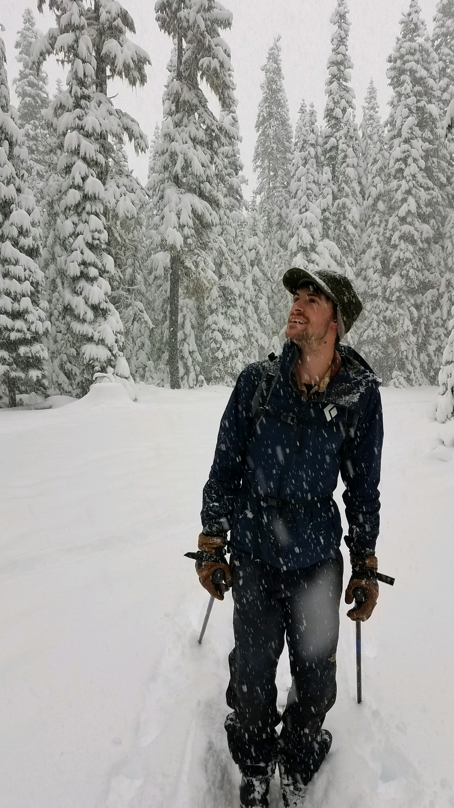

Hello! I am an ecologist and statistician generally interested in how ecological communities assemble and evolve. I grew up in a small, rural town in Colorado with beautiful mountainous surroundings and unique communities of alpine wildflowers. I love the outdoors and like to joke that exercise is my "performance enhancing drug" because it clears my mind and improves my focus.  
